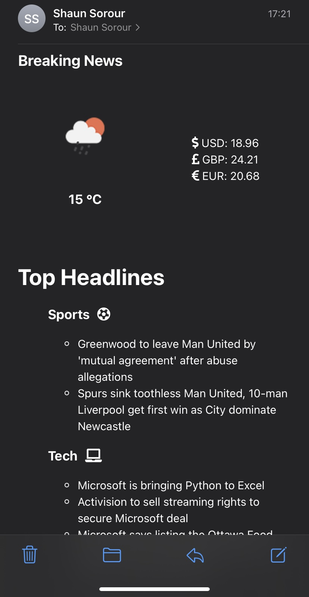
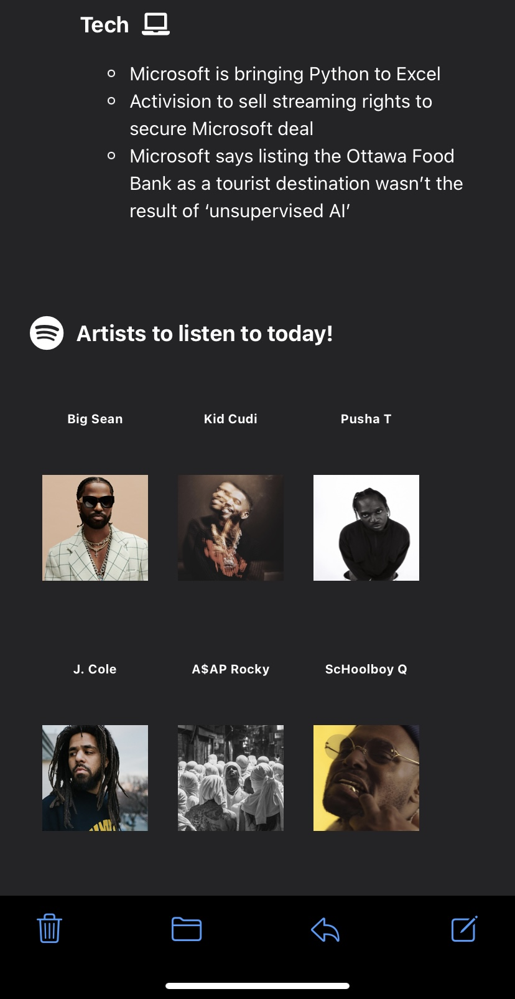

# News Bot

Your daily personalized news feed - Application takes in your interests e.g "Tesla", "Gaming" and with the help of Bard AI finds related articles to be bundled and sent to your mailbox.

News feed also pulls exhange rates and the weather forecast for the day depending on your city. You can also toggle between AI being on or off to manaully refine exactly which news sources and interests you would like to return.

Included in feed:

- 🌤️ Weather forecast 
- ＄ Exchange rates
- 📰 Headlines 
- 🎧 Spotify - Suggested artists


## Screenshots





## Getting started
1. Install dependencies
```bash
pip install -r requirements.txt
```
2. Setup Bard AI

    Go to https://bard.google.com/

    F12 for console

    Go to Application → Cookies → __Secure-1PSID. Copy the value of that cookie.

    Create .env file and add line:

    _BARD_API_KEY=your_cookie_value


## Usage

1. Fill your interests in [params.py](params.py)
2. Fill email account + API credentials in .env - see example [.env-example](.env-example)
3. Run [program.py](program.py)


## Automate daily news email

1. Mac

https://www.jcchouinard.com/python-automation-with-cron-on-mac/